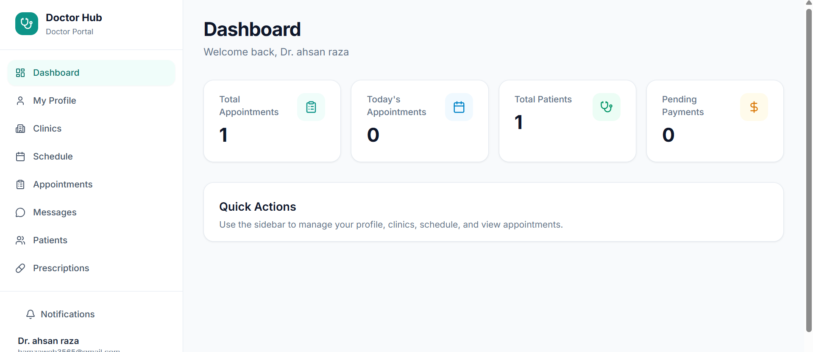

# Doctor Hub

🌐 **Live Demo:** https://haider-092-doctor-hub-frontend.vercel.app/


---

## 🔐 Demo Credentials

| Role | Email | Password | Login URL |
|------|-------|----------|-----------|
| **Super Admin** | haiderwahla199@gmail.com | 12345678 | [/admin/login](/admin/login) |
| **Admin** | ali565waseem@gmail.com  | 12345678 | [/admin/login](/admin/login) |
| **Doctor** | hamzaweb3565@gmail.com | 12345678 | [/login](/login) → Staff Login |
| **Patient** | ali565usman@gmail.com | 12345678 | [/register](/register) |
| **Assistant** | ali65hassan69@gmail.com | 12345678 | [/register](/register) |

---

## 📸 Screenshots

### 🏠 Home Page


### ℹ️ About Page


### 📞 Contact Page


### 📊 Super Admin — Analytics Dashboard


### 🩺 Doctor Portal — Dashboard


---

Unified healthcare platform — patients, doctors, assistants, admins in one React app. **Supabase** backend (PostgreSQL).

## Tech Stack

| Layer | Technology |
|-------|------------|
| Frontend | React 18, Vite, Tailwind CSS, Lucide Icons, Recharts |
| Backend | Node.js, Express 5, Supabase (PostgreSQL) |
| Auth | JWT + bcrypt |
| Uploads | Cloudinary (payment screenshots) |

## Project Structure

```
Doctor-Hub/
├── frontend/     # Unified SPA — all roles
├── backend/      # Supabase REST API
└── docs/         # API docs, phases, security
```

## Quick Start

### 1. Supabase Setup

1. Create a project at [supabase.com](https://supabase.com)
2. Open **SQL Editor** and run these files **in order**:
   - `backend/supabase_schema.sql`
   - `backend/supabase_schedules.sql`
   - `backend/supabase_messages.sql`
   - `backend/supabase_video.sql`
   - `backend/supabase_whatsapp.sql`
   - `backend/supabase_seed.sql` (optional demo data)
   - `backend/supabase_superadmin.sql` (optional super admin)
   - `backend/supabase_admin_approvals.sql` (admin approval + notifications)

### 2. Environment Variables

```bash
cp backend/.env.example backend/.env
cp frontend/.env.example frontend/.env
```

### 3. Install & Run

```bash
# Terminal 1 — Backend
cd backend
npm install
npm run server

# Terminal 2 — Frontend
cd frontend
npm install
npm run dev
```

- Backend: http://localhost:4000
- Frontend: http://localhost:5173
- Health: http://localhost:4000/health

## Required Keys

| Key | Where | How to get |
|-----|-------|------------|
| `JWT_SECRET` | `backend/.env` | Any random string, **min 32 chars** |
| `SUPABASE_URL` | `backend/.env` | Supabase → Settings → API → Project URL |
| `SUPABASE_KEY` | `backend/.env` | Supabase → Settings → API → **service_role** key |
| `FRONTEND_URL` | `backend/.env` | `http://localhost:5173` |
| `VITE_API_URL` | `frontend/.env` | `http://localhost:4000` |

## Optional Keys

| Key | Purpose |
|-----|---------|
| `CLOUDINARY_NAME`, `CLOUDINARY_API_KEY`, `CLOUDINARY_SECRET_KEY` | Payment screenshot uploads |
| `STRIPE_SECRET_KEY` | Online Stripe payments |
| `OPENAI_API_KEY` | AI symptom checker |
| `WHATSAPP_API_URL`, `WHATSAPP_API_TOKEN` | WhatsApp notifications |

## Roles

| Role | Route |
|------|-------|
| Patient | `/patient/*` |
| Doctor | `/doctor/*` |
| Assistant | `/assistant/*` |
| Admin | `/admin/*` |
| Super Admin | `/admin/*` (extra: Admins, Users, Approvals) |

Public: `/`, `/about`, `/contact`, `/login`, `/register`
