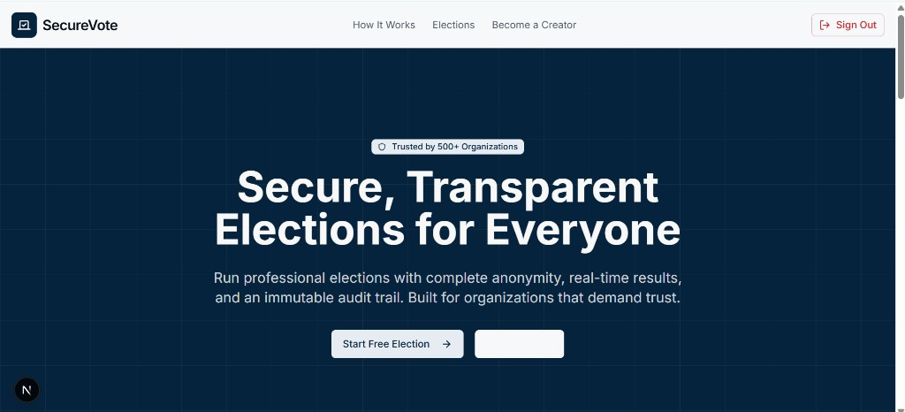
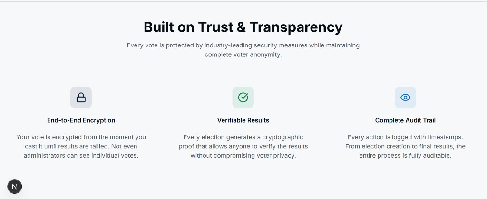
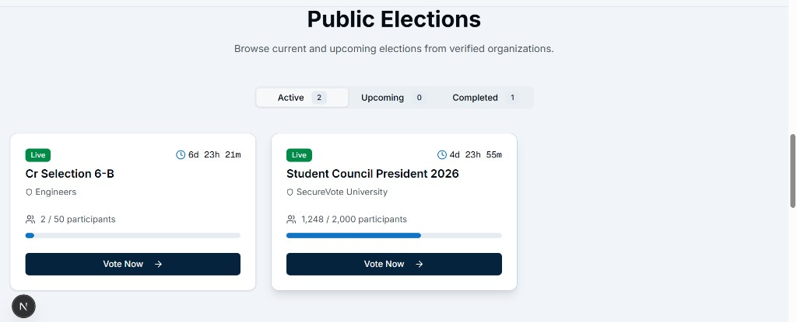
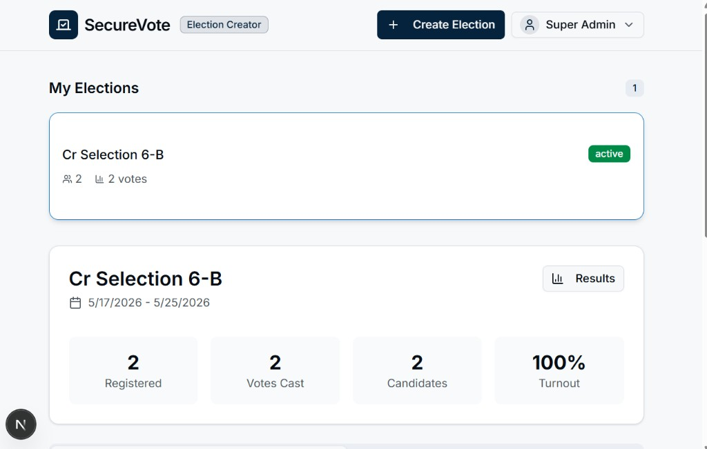
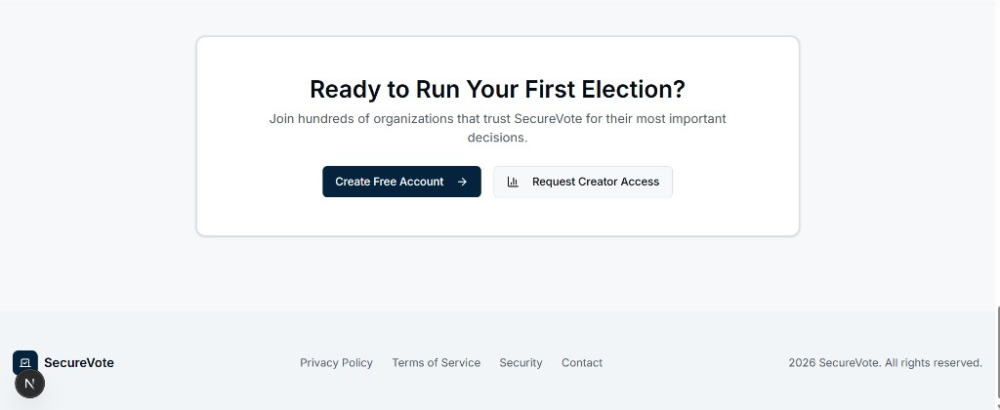
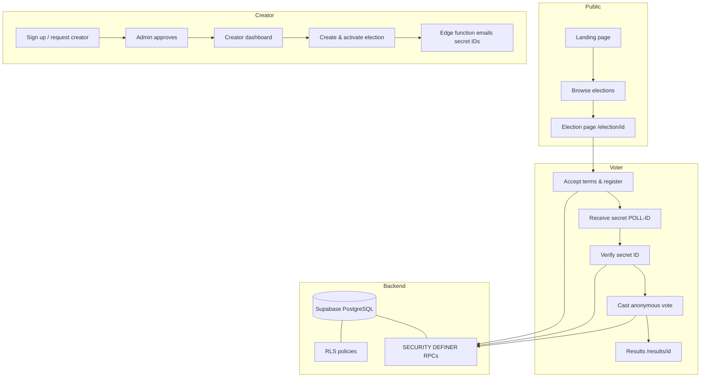

# SecureVote
vercel live link: https://haider-fa-23-092-sec-b-awt-vbak.vercel.app/

---

| Role | Email | Password |
|------|-------|----------|
| **Admin** |admin@securevote.app	| Admin@SecureVote1 | 
| **Creator** | creator@securevote.app | Creator@SecureVote1 | 
| **voter** | voter@securevote.app | Voter@SecureVote1 | 

---


**SecureVote** is a full-stack online election platform built for organizations that need trustworthy digital voting. It combines anonymous ballots, real-time participation metrics, verifiable results, and an immutable audit trail—without exposing how any individual voted.

<p align="center">
  
</p>

---

## Table of Contents

- [Purpose](#purpose)
- [Why It Matters](#why-it-matters)
- [Screenshots](#screenshots)
- [Technology Stack](#technology-stack)
- [Workflow](#workflow)
- [Key Features](#key-features)
- [Getting Started](#getting-started)
- [Project Structure](#project-structure)
- [Documentation](#documentation)
- [License](#license)

---

## Purpose

SecureVote helps schools, universities, clubs, and organizations run professional elections online. The platform supports:

- **Voters** — discover public elections, register, receive a secret poll ID, verify identity, and cast an anonymous vote.
- **Election creators** — create elections, manage candidates, activate voting, and monitor turnout and results.
- **Super admins** — approve creator requests, oversee platform activity, and apply controlled overrides when needed.

The goal is to replace ad-hoc polls and spreadsheets with a single system that is secure, transparent, and easy to use.

---

## Why It Matters

| Challenge | How SecureVote addresses it |
|-----------|----------------------------|
| **Vote privacy** | Votes are stored without voter identity; only secret poll IDs gate ballot access. |
| **Trust in results** | Turnout, charts, and audit logs are visible; RPCs enforce rules server-side. |
| **Fraud prevention** | One vote per registration, case-normalized secret IDs, and duplicate checks in the database. |
| **Accountability** | Admin actions and verification attempts are logged in `audit_logs`. |
| **Accessibility** | Responsive UI, role-based dashboards, and clear step-by-step voting flow. |

Digital elections fail when voters do not trust the process. SecureVote is designed so participants can verify that rules were followed while individual choices stay anonymous.

---

## Screenshots

### Trust & transparency

<p align="center">
  
</p>

End-to-end protection, verifiable outcomes, and a complete audit trail are explained on the landing page.

### Public elections

<p align="center">
  
</p>

Browse **Active**, **Upcoming**, and **Completed** elections with live countdowns and participation progress.

### Creator dashboard

<p align="center">
  
</p>

Creators manage elections, view registered voters, votes cast, candidates, and turnout at a glance.

### Get started

<p align="center">
  
</p>

New users can create an account or request creator access to run their own elections.

---

## Technology Stack

### Frontend

| Technology | Role |
|------------|------|
| [Next.js 16](https://nextjs.org/) | App Router, server/client components, API routes |
| [React 19](https://react.dev/) | UI and interactive voting flows |
| [TypeScript](https://www.typescriptlang.org/) | Type-safe application code |
| [Tailwind CSS 4](https://tailwindcss.com/) | Styling and responsive layout |
| [Radix UI](https://www.radix-ui.com/) | Accessible primitives (dialogs, tabs, forms) |
| [shadcn/ui](https://ui.shadcn.com/) | Composed UI components |
| [Recharts](https://recharts.org/) | Results charts and turnout visualizations |
| [React Hook Form](https://react-hook-form.com/) + [Zod](https://zod.dev/) | Form validation |
| [Lucide React](https://lucide.dev/) | Icons |
| [Sonner](https://sonner.emilkowal.ski/) | Toast notifications |

### Backend & infrastructure

| Technology | Role |
|------------|------|
| [Supabase](https://supabase.com/) | PostgreSQL database, Auth, Row Level Security, Realtime |
| Supabase Edge Functions | Secret ID email delivery, scheduled election locking |
| PostgreSQL RPCs | `cast_vote`, `verify_secret_id_v2`, registration, admin overrides |
| [Resend](https://resend.com/) | Transactional email for secret poll IDs |
| [Vercel](https://vercel.com/) | Hosting and analytics (optional) |

### Tooling

- **ESLint** — linting  
- **PostCSS / Autoprefixer** — CSS processing  
- **Supabase CLI** — migrations and edge function deploys  

---

## Workflow

### High-level system flow



### Voting flow (step by step)

1. **Discover** — Voter opens the landing page and selects a public election (or follows a direct link).
2. **Register** — Authenticated user joins the election; the API assigns a unique `POLL-XXXXXXXX` secret ID.
3. **Acknowledge** — Voter saves the secret ID (shown once; used later to access the ballot).
4. **Verify** — `verify_secret_id_v2` checks the ID, election status, and eligibility without revealing the vote.
5. **Vote** — `cast_vote` records an anonymous row in `votes` and marks the registration as voted.
6. **Results** — Live or completed results show turnout, charts, export (CSV), and share link.

### Role-based access

| Role | Primary routes |
|------|----------------|
| `voter` | `/`, `/election/[id]`, `/results/[id]` |
| `election_creator` | `/creator`, election management |
| `super_admin` | `/admin`, creator approvals, overrides |

---

## Key Features

- Public election listing with realtime updates (Supabase Realtime)
- Multi-step voting UI with verification overlay
- Secret poll ID generation and email distribution
- Anonymous vote storage (no `voter_id` on vote rows)
- Results page with charts, CSV export, and share/copy link
- Creator dashboard with activation and stats
- Super admin panel for creator requests
- Immutable audit logging for sensitive actions
- Row Level Security on all public tables

---

## Getting Started

### Prerequisites

- Node.js 18+
- npm (or pnpm / yarn)
- A [Supabase](https://supabase.com/) project

### Local development

1. **Clone the repository**

   ```bash
   git clone https://github.com/YOUR_USERNAME/Voting-Site.git
   cd Voting-Site
   ```

2. **Install dependencies**

   ```bash
   npm install
   ```

3. **Configure environment variables**

   Create `.env.local` in the project root:

   ```env
   NEXT_PUBLIC_SUPABASE_URL=https://your-project.supabase.co
   NEXT_PUBLIC_SUPABASE_ANON_KEY=your-anon-key
   SUPABASE_SERVICE_ROLE_KEY=your-service-role-key
   NEXT_PUBLIC_APP_URL=http://localhost:3000
   RESEND_API_KEY=your-resend-key
   EMAIL_DOMAIN=your-domain.com
   ```

4. **Set up the database**

   Run SQL files in order in the Supabase SQL Editor (see [DEPLOYMENT.md](./DEPLOYMENT.md)):

   - `backend/database/schema.sql`
   - `backend/database/rls.sql`
   - `backend/database/functions.sql`
   - `backend/database/verify_secret_id_v2.sql` or `backend/database/rpc_text_overloads.sql`

5. **Start the dev server**

   ```bash
   npm run dev
   ```

   Open [http://localhost:3000](http://localhost:3000).

### Production

See **[DEPLOYMENT.md](./DEPLOYMENT.md)** for Supabase Auth URLs, Vercel env vars, edge functions, and creating a super admin.

---

## Project Structure

```
Voting-Site/
├── app/                    # Next.js App Router pages & API routes
│   ├── page.tsx            # Landing (server wrapper)
│   ├── election/[id]/      # Voting flow
│   ├── results/[id]/       # Live results
│   ├── creator/            # Creator dashboard
│   ├── admin/              # Super admin panel
│   └── api/                # Route handlers
├── components/             # UI components (shadcn)
├── hooks/                  # useAuth, useElections, etc.
├── lib/                    # Supabase clients, types, utils
├── backend/database/       # SQL schema, RLS, RPCs
├── docs/images/            # README screenshots
└── DEPLOYMENT.md           # Full deployment guide
```

---

## Documentation

- [DEPLOYMENT.md](./DEPLOYMENT.md) — Supabase, Resend, Vercel, and architecture
- `backend/database/` — SQL migrations and RPC definitions

---

## License

This project is provided for educational and organizational use. Add your license file (`LICENSE`) if you publish the repository publicly.

---

<p align="center">
  <strong>SecureVote</strong> — Secure, transparent elections for everyone.
</p>
